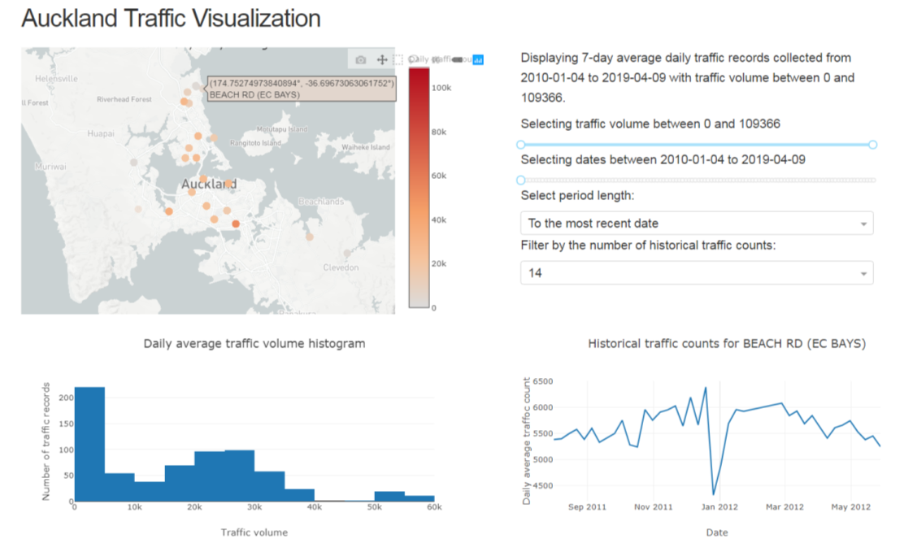

# Auckland_traffic_visualization

An interactive visualization of Auckland traffic data from 2010 available at https://akl-traffic-vis.herokuapp.com/.

Data collected from https://at.govt.nz/about-us/reports-publications/traffic-counts/ on 2019-07-02.
Only the 7-day daily traffic counts after 2010-01-01 are used, since all traffic volume data 
are highly correlated to each other (see this [jupyter notebook](https://github.com/klin059/Auckland_traffic_analysis/blob/master/1_data_cleaning.ipynb).
